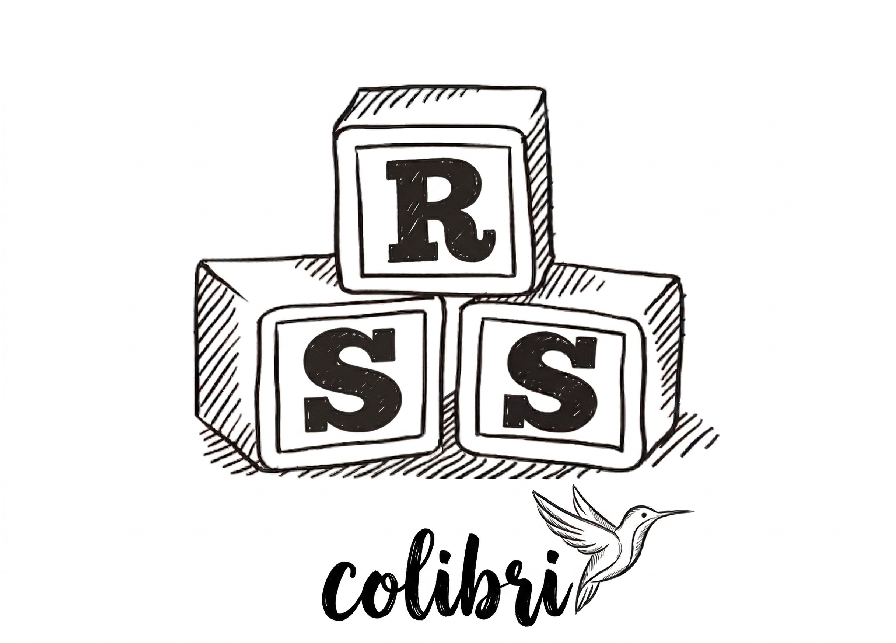

<!-- PROJECT LOGO -->
<br />
<div align="center">
  <h3 align="center">Colibri API</h3>
  <a href="https://github.com/othneildrew/Best-README-Template">
    
  </a>
</div>

<!-- ABOUT THE PROJECT -->
## About The Project

Dealing with RSS feed is messy and unconsistent. Colibri aims to offer a simple but consistent JSON API to build around RSS feed.

How ?:
* We fetch from a list of RSS feeds every 4 hours and save the latest posts
* We generate incosistant field like description with AI agents
* We expose everything through a versionned REST API so your apps don't break

### Built With

- [chi](https://github.com/go-chi/chi)
- [sqlc](https://github.com/sqlc-dev/sqlc)
- [go-feed](https://github.com/mmcdole/gofeed)
- [adk-go](https://github.com/google/adk-go)

### Prerequisites

- [Docker](https://docs.docker.com/get-docker/) & [Docker Compose](https://docs.docker.com/compose/install/)
- A Google API key (for the AI description agent)

### Installation

1. Clone the repo
   ```sh
   git clone https://github.com/maxbrt/colibri.git
   cd colibri
   ```
2. Create a `google_api_key.txt` file at the project root with your Google API key
   ```sh
   echo "your-api-key" > google_api_key.txt
   ```
3. Start all services
   ```sh
   docker compose up --build
   ```

4. Run the fetcher
   ```sh
   go run cmd/fetcher/main.go
   ```

The API will be available at `http://localhost:8080` and the RabbitMQ management UI at `http://localhost:15672`.

<!-- USAGE EXAMPLES -->
## Usage

<!-- ROADMAP -->
## Roadmap

- [ ] Grow the list of registered feed
- [ ] Add logo fetching for every feed
- [ ] Add support for user facing feed registration

See the [open issues](https://github.com/maxbrt/colibri) for a full list of proposed features (and known issues).

<!-- CONTRIBUTING -->
## Contributing

Contributions are what make the open source community such an amazing place. Any contributions you make are **greatly appreciated**.

If you have a suggestion that would make this better, please fork the repo and create a pull request. You can also simply open an issue with the tag "enhancement".
Don't forget to give the project a star! Thanks again!

1. Fork the Project
2. Create your Feature Branch (`git checkout -b feature/AmazingFeature`)
3. Commit your Changes (`git commit -m 'Add some AmazingFeature'`)
4. Push to the Branch (`git push origin feature/AmazingFeature`)
5. Open a Pull Request

### Top contributors:

<a href="https://github.com/maxbrt/colibri/graphs/contributors">
  
</a>

<!-- LICENSE -->
## License

Distributed under the MIT License. See `LICENSE` for more information.

<!-- CONTACT -->
## Contact

Maxime Bourret - maxime.bourret@hey.com

<!-- MARKDOWN LINKS & IMAGES -->
<!-- https://www.markdownguide.org/basic-syntax/#reference-style-links -->
[contributors-shield]: https://img.shields.io/github/contributors/othneildrew/Best-README-Template.svg?style=for-the-badge
[contributors-url]: https://github.com/othneildrew/Best-README-Template/graphs/contributors